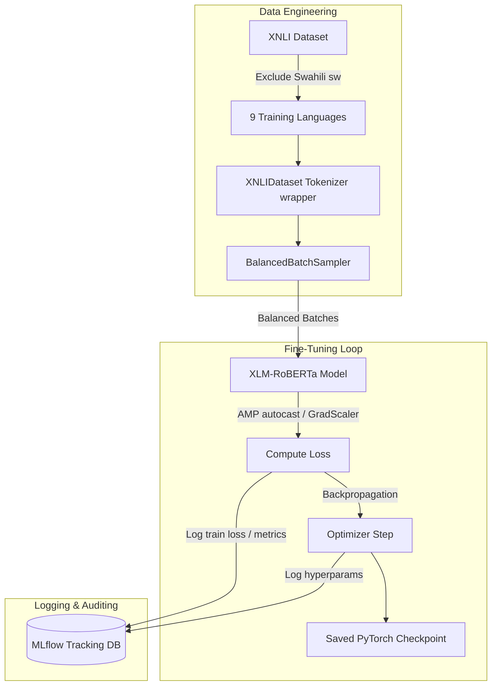
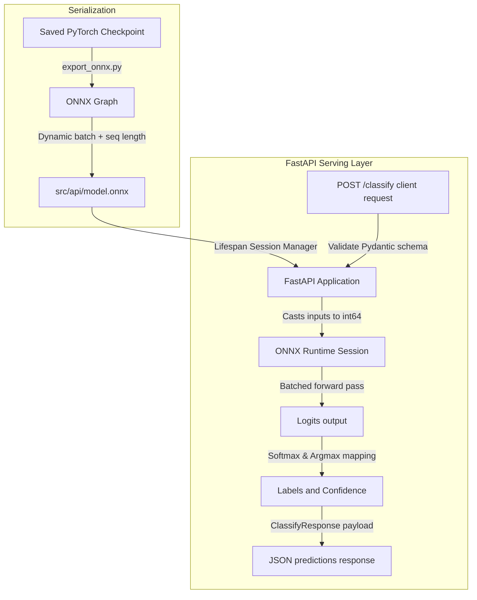

# Multilingual Cross-lingual Natural Language Inference (XNLI) Classification System

This repository implements a production-grade REST API that fine-tunes a multilingual transformer (`xlm-roberta-base`) for Cross-lingual Natural Language Inference (XNLI), exports the fine-tuned model to ONNX, and serves the model via FastAPI inside Docker.

---

## Technical Stack

- **Core Frameworks**: Python 3.10 (pin inside Docker), PyTorch (v2.0+)
- **Transformers & Datasets**: Hugging Face `transformers`, `datasets` (for caching and parallel loading)
- **Serialization & Inference**: `onnx`, `onnxruntime` (for high-performance model serving), `onnxscript`
- **Serving Layer**: FastAPI (ASGI server), Uvicorn, Pydantic (data validation)
- **Tracking & Logging**: MLflow (v2.3+) with SQLite database backend
- **Automation & Quality Assurance**: pytest, httpx, Docker, Docker Compose

---

## Architecture Diagrams

### 1. Data Pipeline and Training Architecture


### 2. Inference and Serving Architecture


---

## Directory Structure

```text
multi-language-text-classification-system/
├── data/                  # raw dataset cache (ignored in Git)
├── checkpoint/            # local PyTorch fine-tuned model checkpoints (ignored in Git)
├── src/
│   ├── data/
│   │   ├── __init__.py    # package identifier
│   │   ├── dataset.py     # joint tokenization implementation (XNLIDataset)
│   │   └── sampler.py     # stratified round-robin batch sampler (BalancedBatchSampler)
│   ├── models/
│   │   └── model.py       # model and tokenizer loading wrappers
│   ├── training/
│   │   └── trainer.py     # AMP training step and validation F1 execution
│   └── api/
│       └── main.py        # FastAPI endpoints, Pydantic schemas, lifespan ONNX manager
├── tests/
│   ├── test_api.py        # tests for FastAPI validation, endpoints, and edge cases
│   └── test_data.py       # unit tests for XNLIDataset and BalancedBatchSampler
├── scripts/
│   ├── train.py           # pipeline fine-tuning CLI
│   ├── export_onnx.py     # dynamic-axes model exporter
│   └── evaluate.py        # evaluation metrics and latency report CLI
├── docker-compose.yml     # Compose file orchestrating the serving container
├── Dockerfile             # Multi-stage lightweight serving image build
├── .env.example           # Example configuration file
├── .env                  # local environment variables configuration (ignored in Git)
├── .gitignore             # clean project-scoped Git rules
├── submission.yml         # pipeline execution tasks command mappings
├── evaluation.json        # performance output results file
└── EVALUATION.md          # detailed evaluation metrics report
```

---

## Core System Operations

### 1. Data Engineering & Language Balancing
- **Joint Tokenization**: The `XNLIDataset` class tokenizes the `premise` and `hypothesis` inputs jointly, appending sequence delimiters as required by the pretrained tokenizer.
- **Stratified Batch Sampling**: To prevent the model from overfitting to one language, `BalancedBatchSampler` groups samples by their language code. For a batch of size $B$, it draws $B // 9$ indices from each of the 9 training languages. Any remainder is systematically distributed across the pools. pools are reshuffled at the start of each training epoch.
- **Zero-Shot Isolation**: The Swahili (`sw`) validation and test sets are completely isolated and never loaded into training pools, serving exclusively for pure zero-shot validation during evaluation.

### 2. Automatic Mixed Precision (AMP) Training
Training leverages PyTorch's mixed-precision libraries to accelerate training speed and reduce GPU memory footprint:
- **`autocast()`**: Wraps forward passes to execute selected operations in FP16.
- **`GradScaler`**: Automatically scales gradients during backpropagation to prevent underflow.

### 3. Dynamic Axes ONNX Export
The model is exported to ONNX with dynamic configurations for `input_ids` and `attention_mask`. Both axes (dimension 0: `batch_size`, and dimension 1: `sequence_length`) are dynamic, allowing the model to perform inference on variable-sized batches and sequences without needing compilation.

---

## Setup & Running Guide

### 1. Prerequisite Config Setup
To clone and run, copy the configuration variables into a local environment file:
```bash
cp .env.example .env
```

### 2. Dependency Installation
Install python dependencies in your environment:
```bash
pip install -r requirements.txt
```

### 3. Fine-Tuning the Model
Run the fine-tuning pipeline. Use the `--smoke_test` flag to quickly verify the pipeline end-to-end with small datasets:
```bash
python scripts/train.py --epochs 1 --smoke_test --checkpoint_dir checkpoint
```
*Note: Remove `--smoke_test` to execute a full training job.*

### 4. ONNX Export and Zero-Shot Evaluation
Generate the ONNX model and compute performance metrics. This writes results to `evaluation.json` and updates `EVALUATION.md`:
```bash
python scripts/evaluate.py --smoke_test --checkpoint_dir checkpoint
```

### 5. Serving via Docker Compose
Build and serve the containerized API on port `8000`:
```bash
docker-compose up -d --build
```
You can access the built-in interactive **Swagger UI documentation frontend** at: [http://localhost:8000/docs](http://localhost:8000/docs).

### 6. Running Tests
- **Automated Pytest Suite**: Run the test suite to verify data sampling, schema validation, and serving capabilities:
  ```bash
  pytest tests/
  ```
- **Postman Testing**: Import the file [postman_collection.json](file:///c:/GPP/Task30%20-%20Multi-language%20Text%20Classification%20System/multi-language-text-classification-system/postman_collection.json) at the root level of this repository into your Postman application. This collection includes pre-built dynamic test scripts targeting the `/health` and `/classify` endpoints, and validates normal cases, empty list requests (400), and missing parameter constraints (422).


---

## API Documentation

### POST `/classify`

**Request Schema**:
```json
{
  "pairs": [
    {
      "premise": "I love pair programming with AI.",
      "hypothesis": "I enjoy coding with AI assistants."
    }
  ]
}
```

**Response Schema**:
```json
{
  "predictions": [
    {
      "premise": "I love pair programming with AI.",
      "hypothesis": "I enjoy coding with AI assistants.",
      "label": "entailment",
      "confidence": 0.9412
    }
  ]
}
```

---

## Evaluation Guidelines
Check [EVALUATION.md](file:///c:/GPP/Task30%20-%20Multi-language%20Text%20Classification%20System/multi-language-text-classification-system/EVALUATION.md) for tables representing metrics (Precision, Recall, F1) across the 9 training languages, zero-shot evaluation on Swahili, and a latency speedup analysis comparing PyTorch vs. ONNX Runtime execution.
